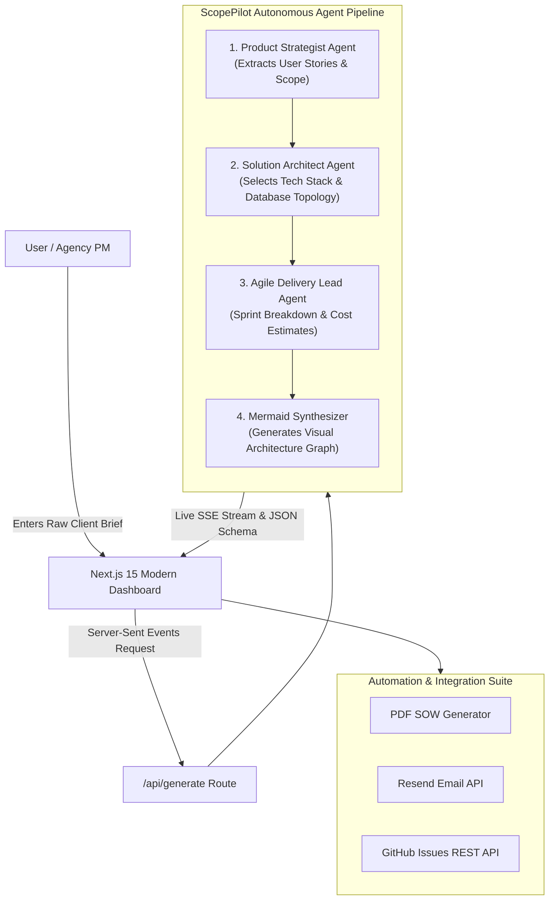

# 🚀 ScopePilot AI — Autonomous Product Blueprint & Proposal Agent
### *Autonomous Architecture & SOW Generation Platform*

[](https://nextjs.org/)
[](https://www.typescriptlang.org/)
[](https://tailwindcss.com/)
[](https://mermaid.js.org/)
[](https://vercel.com/)

**ScopePilot AI** is an autonomous full-stack product engineering agent that bridges the gap between raw, unstructured client inquiries and production-ready software specifications. Built for fast-moving product studios, digital agencies, and innovation labs, it transforms complex ideas into comprehensive technical blueprints, interactive architecture diagrams, user story backlogs, and costed sprint roadmaps in seconds.

---

## 🌟 Key Features & Agent Capabilities

- 🤖 **Multi-Agent Collaboration Stream**:
  - **Product Strategist Agent**: Deconstructs raw client briefs, identifies key personas, problem statements, and delineates MVP boundaries from future V2 releases.
  - **Solution Architect Agent**: Selects optimal frontend, backend, database, and cloud layers with explicit technical rationale.
  - **Agile Delivery Lead Agent**: Formulates a realistic 4-to-6 sprint roadmap, resource allocation, and budget estimates.
  - **Mermaid Visualizer Agent**: Compiles live interactive system architecture flowcharts rendered in real-time.
- ⚡ **Zero-Friction Instant Demo Mode**: Reviewers and clients can test the complete agent pipeline out-of-the-box with pre-curated high-impact presets (Padel Booking App, AI Invoicing SaaS, NHS HealthTech Portal) without requiring API keys.
- 📐 **Interactive Mermaid.js Architecture Diagram**: Live rendering with fullscreen mode, SVG generation, and 1-click source export.
- 📑 **One-Click Client Proposal PDF**: High-fidelity printable and downloadable Scope of Work (SOW) proposal document.
- ✉️ **Autonomous Email Dispatch**: Integrated with the **Resend API** to deliver structured executive summaries directly to clients.
- 🐙 **GitHub Backlog Sync**: Automatically converts user stories and acceptance criteria checklists into **GitHub Issues** via GitHub REST API.

---

## 🏗️ System Architecture



---

## 🛠️ Tech Stack & Job Description Alignment

| Domain | Technologies Used |
| :--- | :--- |
| **Full Stack** | Next.js 15 (React 19), TypeScript, Tailwind CSS, Lucide Icons |
| **AI / LLMs & Agents** | Structured schema generation, Gemini 2.0 / OpenAI fallback, multi-step agent reasoning |
| **APIs** | Server-Sent Events (SSE) streaming, GitHub REST API, Resend Transactional Email API |
| **Cloud & Deployment** | Vercel Edge runtime, GitHub Actions CI/CD ready, zero-config deployment |
| **Automation** | 1-click PDF synthesis, automated GitHub issue formatting, automated proposal delivery |
| **Product Development** | Real-world problem solving for digital studios and tech consultancies |

---

## 🚀 Quickstart Guide

### 1. Clone & Install Dependencies
```bash
git clone https://github.com/your-username/scopepilot-ai.git
cd scopepilot-ai
npm install
```

### 2. Environment Variables (Optional)
The project runs seamlessly in **Instant Demo Mode** without any keys. To enable live external integrations, create a `.env.local` file:

```env
# Optional: Live LLM inference
GEMINI_API_KEY=your_gemini_api_key_here
OPENAI_API_KEY=your_openai_api_key_here

# Optional: Live Email proposal dispatch
RESEND_API_KEY=your_resend_api_key_here

# Optional: GitHub backlog sync
GITHUB_TOKEN=your_github_token_here
```

### 3. Run Development Server
```bash
npm run dev
```
Open [http://localhost:3000](http://localhost:3000) in your browser.

### 4. Build for Production
```bash
npm run build
npm run start
```

---

## 👨‍💻 Enterprise Product Architecture Platform
*Designed for agile product studios, software consultancies, and digital agencies.*
