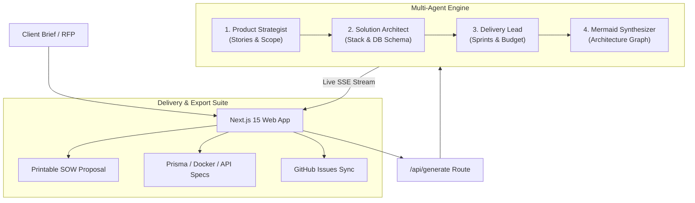

# 🚀 ScopePilot AI

> **Autonomous Full-Stack Product Blueprint & Technical Architecture Agent**

[](https://nextjs.org/)
[](https://www.typescriptlang.org/)
[](https://tailwindcss.com/)
[](https://mermaid.js.org/)
[](LICENSE)

**ScopePilot AI** transforms raw, unstructured client requirements and RFPs into production-ready software specifications in seconds. It coordinates specialized AI agents (Product Strategist, Cloud Architect, Delivery Lead) to deliver interactive architecture diagrams, user stories, executable starter code, and costed sprint roadmaps.

---

## ⚡ Key Capabilities

- 🤖 **Multi-Agent Orchestration**: Real-time collaborative pipeline delineating MVP boundaries, user stories, and acceptance criteria.
- 📐 **Interactive Architecture**: Auto-rendered Mermaid.js diagrams with fullscreen mode, SVG generation, and source export.
- 💻 **Developer Starter Kit**: Auto-generates `schema.prisma` models, `docker-compose.yml`, and typed REST API routes.
- 🔄 **Conversational AI Refinement**: Dynamic feedback loop allowing users to refine scope, add mobile apps, or optimize budgets in real time.
- 💱 **Interactive Financial Modeler**: Dynamic currency switcher (**$ USD**, **£ GBP**, **€ EUR**) with live hourly rate recalculation.
- 📄 **Executive SOW Proposal & PDF**: One-click printable Statement of Work (SOW) proposal documents with sign-off blocks.
- 📦 **1-Click Starter Scaffold (.zip)**: Instant bundle download containing `schema.prisma`, `docker-compose.yml`, `.env.example`, and full specification.
- 🛡️ **Security & Compliance Audit**: OWASP/STRIDE threat matrix, GDPR readiness checklist, and disaster recovery RTO/RPO metrics.
- 🎙️ **Voice Dictation**: Real-time microphone speech-to-text integration for effortless client brief dictation.
- 🚀 **Zero-Key Demo Mode**: Pre-loaded with curated presets (Padel Booking App, AI Invoicing SaaS, NHS Telehealth Hub).

---

## 🏗️ Architecture



---

## 🛠️ Tech Stack

| Layer | Technologies |
| :--- | :--- |
| **Frontend** | Next.js 15 (React 19), TypeScript, Tailwind CSS, Lucide Icons |
| **AI & Agents** | Multi-agent structured prompting, SSE streaming, Gemini / OpenAI fallback |
| **Diagrams & Visuals** | Mermaid.js dynamic SVG rendering |
| **Integrations** | GitHub REST API, Resend Email API |
| **Infrastructure** | Edge-ready runtime, Docker Compose, Prisma ORM |

---

## 🚀 Quick Start

### 1. Installation
```bash
git clone https://github.com/iamyoussef2005/scopepilot-ai.git
cd scopepilot-ai
npm install
```

### 2. Run Development Server
```bash
npm run dev
```
Open [http://localhost:3000](http://localhost:3000) to launch the dashboard.

### 3. Environment Variables (Optional)
The application works immediately in **Demo Mode**. For live API execution, add to `.env.local`:
```env
GEMINI_API_KEY=your_key_here
RESEND_API_KEY=your_key_here     # For live email dispatch
GITHUB_TOKEN=your_token_here     # For live issue creation
```

---

## 📄 License
MIT © [iamyoussef2005](https://github.com/iamyoussef2005)
